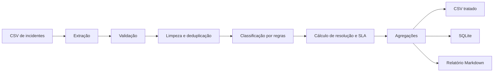

<p align="center">
  
</p>

<h1 align="center">ETL Service Desk Incidents</h1>

<p align="center">
  Pipeline em Python para processar incidentes de suporte, classificar chamados, calcular tempo de resolução, identificar violações de SLA e gerar dados prontos para análise.
</p>

<p align="center">
  
  
  
  
  <a href="https://github.com/cmosantos/etl-service-desk-incidents/actions/workflows/tests.yml">
    
  </a>
</p>

---

## Visão geral

Este projeto representa um cenário de **Service Desk** no qual dados de incidentes precisam ser tratados e transformados em indicadores operacionais.

O pipeline recebe um arquivo CSV, valida a estrutura, remove registros inválidos e duplicados, classifica chamados por categoria, calcula o tempo de resolução, compara cada incidente com a meta de SLA e entrega os resultados em formatos adequados para consulta e análise.

O projeto utiliza somente a **biblioteca padrão do Python**, sem dependências externas.

---

## Valor para o negócio

O fluxo demonstra como automatizar tarefas comuns de consolidação de dados em operações de suporte:

- identificar as categorias com maior volume de incidentes;
- acompanhar a distribuição por prioridade;
- medir violações de SLA;
- padronizar dados antes de relatórios e dashboards;
- criar uma base estruturada para análises futuras;
- reduzir trabalho manual no tratamento de chamados.

---

## Arquitetura



Mais detalhes em [`docs/architecture.md`](./docs/architecture.md).

---

## Funcionalidades

### Extração

- leitura de arquivos CSV;
- validação das colunas obrigatórias;
- interrupção do processo quando a estrutura de entrada é inválida.

### Transformação

- remoção de registros sem `ticket_id`;
- eliminação de chamados duplicados;
- cálculo do tempo de resolução em minutos;
- associação entre prioridade e meta de SLA;
- identificação de violações;
- enriquecimento com dia da semana e hora de abertura;
- classificação automática por palavras-chave.

### Carregamento

- geração de CSV processado;
- criação de banco SQLite;
- geração de relatório em Markdown;
- consolidação por categoria e prioridade;
- cálculo da taxa de violação de SLA.

---

## Regras de SLA

| Prioridade | Meta de resolução |
|---|---:|
| P1 | 60 minutos |
| P2 | 120 minutos |
| P3 | 240 minutos |
| P4 | 480 minutos |

Um incidente é marcado como violação quando o tempo de resolução ultrapassa a meta definida para sua prioridade.

---

## Classificação dos chamados

A classificação utiliza regras transparentes baseadas no título e na descrição.

| Categoria | Exemplos de termos |
|---|---|
| M365 | Outlook, Teams, Exchange, Defender, Microsoft 365 |
| Rede | VPN, switch, latência, perda de pacote, roteador |
| Acesso | senha, MFA, permissão, bloqueio, falha de login |
| Backup | backup, restore, Veeam, job, storage |
| Servidor | categoria padrão quando nenhuma regra é encontrada |

> O classificador é propositalmente simples e não utiliza machine learning. Ele representa uma primeira etapa de automação baseada em regras.

---

## Dados processados

### Colunas obrigatórias

| Campo | Descrição |
|---|---|
| `ticket_id` | Identificador único do incidente |
| `created_at` | Data e hora de abertura em formato ISO |
| `resolved_at` | Data e hora de resolução em formato ISO |
| `priority` | Prioridade P1, P2, P3 ou P4 |
| `title` | Título do incidente |
| `description` | Descrição do problema |

### Campos gerados

| Campo | Descrição |
|---|---|
| `resolution_minutes` | Tempo total de resolução |
| `sla_minutes` | Meta associada à prioridade |
| `is_sla_breach` | Indicador de violação: `0` ou `1` |
| `dow` | Dia da semana da abertura |
| `hour` | Hora da abertura |
| `category_pred` | Categoria calculada pelas regras |

Consulte o dicionário completo em [`docs/data-dictionary.md`](./docs/data-dictionary.md).

---

## Resultado do exemplo atual

O relatório incluído no repositório foi gerado a partir de **500 incidentes sintéticos**.

| Indicador | Resultado |
|---|---:|
| Registros de entrada | 500 |
| Registros processados | 500 |
| Registros descartados | 0 |
| Violações de SLA em P1 | 70,09% |
| Violações de SLA em P2 | 38,10% |
| Violações de SLA em P3 | 0,00% |
| Violações de SLA em P4 | 0,00% |

Veja o resultado completo em [`outputs/reports/summary.md`](./outputs/reports/summary.md).

---

## Como executar

### 1. Clone o repositório

```bash
git clone https://github.com/cmosantos/etl-service-desk-incidents.git
cd etl-service-desk-incidents
```

### 2. Crie o ambiente virtual

Windows PowerShell:

```powershell
python -m venv .venv
.\.venv\Scripts\Activate.ps1
```

Linux ou macOS:

```bash
python3 -m venv .venv
source .venv/bin/activate
```

### 3. Instale os requisitos

```bash
pip install -r requirements.txt
```

O projeto não possui dependências externas; o arquivo registra essa característica.

### 4. Gere os dados sintéticos

```bash
python -m src.generate_sample_data
```

### 5. Execute o pipeline

```bash
python -m src.pipeline --input data/raw/incidents.csv
```

---

## Saídas geradas

```text
data/processed/incidents_clean.csv
outputs/db/incidents.sqlite
outputs/reports/summary.md
```

Os caminhos também podem ser personalizados:

```bash
python -m src.pipeline \
  --input data/raw/incidents.csv \
  --clean_csv data/processed/incidents_clean.csv \
  --db outputs/db/incidents.sqlite \
  --report outputs/reports/summary.md
```

---

## Testes automatizados

O projeto utiliza `unittest`, também disponível na biblioteca padrão do Python.

Execute localmente:

```bash
python -m unittest discover -s tests -v
```

Os testes verificam:

- classificação de incidentes;
- enriquecimento dos registros;
- cálculo e identificação de violação de SLA;
- remoção de duplicidades;
- descarte de registros sem identificador.

O workflow em `.github/workflows/tests.yml` executa os testes automaticamente em cada `push` e `pull request` para a branch `main`.

---

## Estrutura do projeto

```text
etl-service-desk-incidents/
├── .github/
│   └── workflows/
│       └── tests.yml
├── assets/
│   └── etl-service-desk-banner.svg
├── data/
│   ├── raw/
│   └── processed/
├── docs/
│   ├── architecture.md
│   └── data-dictionary.md
├── outputs/
│   ├── db/
│   └── reports/
│       └── summary.md
├── src/
│   ├── extract.py
│   ├── generate_sample_data.py
│   ├── load.py
│   ├── pipeline.py
│   └── transform.py
├── tests/
│   └── test_transform.py
├── .gitignore
├── requirements.txt
└── README.md
```

---

## Limitações atuais

- os dados do exemplo são sintéticos;
- a classificação é baseada em palavras-chave;
- os campos são persistidos como texto no SQLite;
- ainda não há interface gráfica ou dashboard;
- o processamento é feito em memória e foi pensado para pequenos volumes.

Essas limitações são apresentadas de forma transparente porque o objetivo atual é demonstrar o fluxo ETL e o raciocínio operacional aplicado a incidentes de Service Desk.

---

## Próximas evoluções

- validar datas e prioridades com mensagens mais detalhadas;
- criar dashboard com indicadores de SLA;
- adicionar análise de tendência por período;
- integrar dados exportados de Jira ou outra ferramenta ITSM;
- melhorar a tipagem dos campos no SQLite;
- substituir o classificador de regras por um modelo de machine learning.

---

## Autor

**Cláudio Santos**  
Analista de Suporte Júnior | Microsoft 365 | Cloud e Automação com IA

- [GitHub](https://github.com/cmosantos)
- [LinkedIn](https://www.linkedin.com/in/claudio--santos/)
- [Portfólio](https://future-cloud-ai.lovable.app)
- [Hashnode](https://claudiosantos.hashnode.dev)

---

<p align="center">
  Projeto desenvolvido para demonstrar tratamento de dados, automação operacional e análise de incidentes de Service Desk com Python.
</p>
