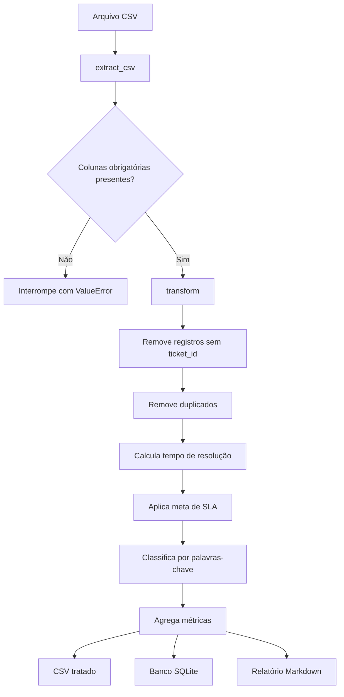

# Arquitetura do ETL Service Desk Incidents

## Objetivo

O projeto organiza dados de incidentes de suporte em um fluxo ETL simples, reproduzível e sem dependências externas.

## Fluxo principal

## Componentes

### `src/generate_sample_data.py`

Cria dados sintéticos de incidentes com categorias, prioridades, horários e solicitantes fictícios. O gerador usa uma semente fixa para permitir resultados reproduzíveis.

### `src/extract.py`

Lê o arquivo CSV com `csv.DictReader` e valida a presença das colunas obrigatórias:

- `ticket_id`
- `created_at`
- `resolved_at`
- `priority`
- `title`
- `description`

### `src/transform.py`

Executa as regras de transformação:

- remove registros sem identificador;
- elimina duplicidade por `ticket_id`;
- converte datas ISO para objetos `datetime`;
- calcula o tempo de resolução;
- associa prioridade à meta de SLA;
- identifica violação de SLA;
- extrai dia da semana e hora;
- classifica o chamado com regras de palavras-chave.

### `src/load.py`

Entrega os resultados em três formatos:

- CSV processado;
- banco SQLite;
- relatório Markdown com agregações.

### `src/pipeline.py`

É o ponto de entrada do fluxo completo. Ele aceita parâmetros de linha de comando para definir os arquivos de entrada e saída.

## Decisões técnicas

- **Somente biblioteca padrão:** facilita a execução em qualquer ambiente com Python.
- **SQLite:** permite consultar os incidentes processados sem instalar um servidor de banco de dados.
- **Markdown:** deixa o relatório legível diretamente no GitHub.
- **Classificação por regras:** mantém o projeto simples e transparente antes de uma futura evolução para machine learning.

## Limitações arquiteturais

- processamento em memória;
- ausência de testes automatizados;
- validação básica de datas e prioridades;
- campos persistidos como texto no SQLite;
- adequado para demonstração e pequenos volumes, não para processamento distribuído.

## Possíveis evoluções

- testes unitários e integração contínua;
- tipagem mais forte no banco;
- logs estruturados;
- configuração externa de SLA e regras;
- dashboard com indicadores;
- integração com Jira, ServiceNow ou outra plataforma ITSM;
- classificação por modelo de machine learning.
